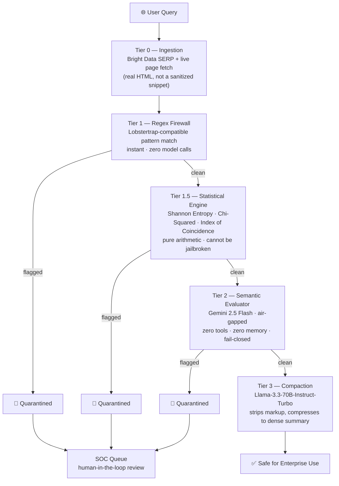

<div align="center">

# 🛡️ Phalanx AI

### The Air Gap Between User & AI.

**A production-style, multi-agent firewall that sanitizes untrusted web data *before* it ever reaches your enterprise AI model.**

[](#)
[](#)
[](#)
[](#)

</div>

---

## The Problem

Autonomous AI agents are now routinely sent out to scrape the open web — forums, product pages, competitor sites — and feed whatever they find straight into an LLM's context window.

That's the attack surface.

- **Indirect prompt injection** — attackers hide instructions inside zero-font CSS, HTML comments, or base64-encoded blobs on otherwise normal-looking pages.
- **The judge problem** — most "AI security" tools just use *another* LLM to police the first one. But a language model evaluating untrusted text is still a language model that can be talked into a bad answer by the exact same techniques it's meant to catch.
- **Tier-0 failure** — enterprise ingestion agents get blocked by basic 403s and CAPTCHAs before they even reach the page they're trying to inspect.

Most pipelines either trust the data blindly, or trust a single AI judge that can itself be fooled. Phalanx does neither.

## The Solution

Phalanx is a **five-stage, defense-in-depth pipeline**. Every payload is interrogated by increasingly expensive, increasingly intelligent tiers — cheapest and hardest-to-fool first — before it's allowed anywhere near your production model.



The same five stages run as **three independent, live agents on the Band SDK** — `PhalanxIngestion`, `PhalanxSecurity`, `PhalanxCompactor` — each in its own session, handing work off by literally `@mentioning` the next agent inside a shared chat room.

```
@PhalanxIngestion → INGEST_COMPLETE | source=dell.com | chars=8000 | payload follows...
@PhalanxSecurity  → QUARANTINED | stage=STATISTICAL | reason=StatisticalAnomaly
                     (Compactor is never mentioned. Zero-trust delegation, not a flag check.)
@PhalanxSecurity  → @PhalanxCompactor SECURITY_CLEARED | risk_score=0.03
```

If a payload is flagged at any tier, the chain stops cold — the next agent in line is never even mentioned, let alone given the data.

---

## Why This Is Different

| | Typical "LLM security" tool | Phalanx |
|---|---|---|
| **Core defense** | Another LLM judging the first LLM | Math first, regex first — LLM only sees what survives both |
| **Jailbreak surface** | The judge itself can be manipulated | Tier 1.5 has *no language understanding to manipulate* — it counts characters and runs published cryptanalytic formulas |
| **Cost model** | Every payload costs a model call | Cheapest, most deterministic checks run first; tokens are only spent on what's already passed two free filters |
| **Ingestion** | Often a sanitized search snippet | Real fetched HTML — the actual attack surface, not a preview of it |
| **Failure mode** | Ambiguous / fails open | Fail-closed at every tier: any parse error, timeout, or schema violation → automatic quarantine |

### Tier 1.5 — "In Math We Trust"

The most defensible part of this architecture. It runs **zero AI models**. Five independent signals, all classical cryptanalysis applied to raw character statistics:

1. **Shannon Entropy (global)** — encoded/random payloads carry far more information density than prose.
2. **Sliding-Window Entropy** — catches a short obfuscated blob hidden inside an otherwise normal paragraph, where a single global average would dilute it away.
3. **Compression Ratio** — natural language is redundant and compresses well; encoded data barely compresses at all.
4. **Chi-Squared Letter Frequency** — compares the sample's letter distribution against real English; ciphertext doesn't follow it.
5. **Index of Coincidence** — Friedman's classical measure of how skewed (English) vs. uniform (random) a distribution is.

None of these can be prompt-injected. They have no language understanding to manipulate.

---

## Architecture

```
phalanx/
├── backend/
│   ├── main.py                    # FastAPI app, routes, CORS, lifespan startup checks
│   ├── pipelines.py                # Orchestrates the 5-stage pipeline end to end
│   ├── agents.py                   # IngestionAgent · SecurityAgent (Gemini) · CompactorAgent (Llama)
│   ├── proxy_client.py             # Tier 1 — regex pattern matching with false-positive validators
│   ├── stats_agent.py              # Tier 1.5 — the five-signal statistical engine
│   ├── schemas.py                  # Pydantic request/response models
│   ├── config.py                   # Centralized environment config
│   ├── band_ingestion_agent.py     # Live Band agent — Stage 1
│   ├── band_security_agent.py      # Live Band agent — Stage 2 (regex + stats + Gemini)
│   └── band_compactor_agent.py     # Live Band agent — Stage 3
├── frontend/
│   ├── pages/
│   │   ├── LandingPage.jsx         # Hero, 3D shield visualizer, tech partners
│   │   ├── CommandCentre.jsx       # Live pipeline simulator + Band transcript
│   │   ├── SOCQueue.jsx            # Human-in-the-loop threat review table
│   │   └── StatsAgent.jsx          # Signal Explorer — test the math engine live, no scraping
│   └── components/
│       ├── PipelineSimulator.jsx   # Tries the real backend, falls back to an honest local sim
│       ├── BandTranscript.jsx      # Live agent handoff log
│       └── ShieldVisualiser.jsx    # react-three-fiber shield wall
└── lobstertrap/                    # Go binary prototype for a zero-latency edge proxy tier
```

---

## Tech Stack

| Layer | Technology |
|---|---|
| Orchestration | **Band SDK** — live multi-agent chat rooms, real `@mention` handoffs |
| Ingestion | **Bright Data** — compliant SERP discovery + real page fetch (no CAPTCHA bypass) |
| Regex Tier | Custom pattern engine, Lobstertrap-compatible (Go binary prototype in `/lobstertrap`) |
| Statistical Tier | Pure Python — `math`, `zlib`, `collections.Counter`. Zero ML dependencies. |
| Semantic Tier | **Gemini 2.5 Flash** via Vertex AI — air-gapped, schema-constrained JSON output |
| Compaction | **Llama-3.3-70B-Instruct-Turbo** via AI/ML API |
| Backend | **FastAPI**, Python 3.12, `httpx`, Pydantic v2 |
| Frontend | **React + Vite**, Tailwind CSS, `lucide-react`, `@react-three/fiber` / `drei` / `three` |
| Infra | Google Cloud (Vertex AI, Cloud Shell) |

---

## Getting Started

### Backend

```bash
cd backend
pip install -r requirements.txt
```

Create a `.env` in `backend/`:

```env
GCP_PROJECT_ID=your-gcp-project
GCP_REGION=us-central1
GEMINI_MODEL=gemini-2.5-flash
GOOGLE_APPLICATION_CREDENTIALS=./phalanx-key.json

BRIGHT_DATA_API_KEY=your-brightdata-key
BRIGHT_DATA_ZONE=your-serp-zone

AI_ML_API_KEY=your-aimlapi-key

LOCAL_PROXY_URL=http://localhost:8080
LOBSTER_TRAP_ENABLED=true

# Only needed for the live Band agents:
GEMINI_API_KEY=your-gemini-api-key
THENVOI_WS_URL=wss://app.band.ai/...
THENVOI_REST_URL=https://app.band.ai/api/v1
```

Run the API:

```bash
uvicorn main:app --reload --port 8000
```

Run the live Band agents (each in its own terminal):

```bash
python band_ingestion_agent.py
python band_security_agent.py
python band_compactor_agent.py
```

### Frontend

```bash
cd frontend
npm install
```

Create a `.env`:

```env
VITE_API_URL=http://localhost:8000
```

```bash
npm run dev
```

---

## API Reference

| Method | Endpoint | Description |
|---|---|---|
| `GET` | `/health` | Liveness + quarantine queue depth |
| `POST` | `/api/v1/analyze` | Run the full pipeline on a query, or pass `raw_payload` to test a crafted string directly without live scraping |
| `GET` | `/api/v1/quarantine` | List pending quarantine alerts |
| `POST` | `/api/v1/quarantine/{id}/approve` | SOC analyst approves a flagged payload |
| `POST` | `/api/v1/quarantine/{id}/reject` | SOC analyst rejects a flagged payload |
| `GET` | `/docs` | Swagger UI |

```bash
curl -X POST http://localhost:8000/api/v1/analyze \
  -H "Content-Type: application/json" \
  -d '{"query": "What are the specs of the Lenovo IdeaPad 330?", "raw_payload": null}'
```

---

## What's Real vs. What's Roadmap

Built solo, in under two weeks, for a hackathon. Being straight about where the edges are:

- ✅ All five pipeline tiers run end-to-end against live, real-world web pages — not mocked data.
- ✅ Fail-closed by design at every tier: parse errors, timeouts, and schema violations all default to quarantine, never silent pass-through.
- ✅ Three Band agents run as genuinely separate live processes with real `@mention`-driven handoffs.
- 🚧 **JS-rendered pages** (SPA product configurators, video platforms) return little or no usable text since there's no headless-browser render step yet — static HTML fetch only.
- 🚧 **Lobstertrap** ships today as an in-process Python regex tier; the standalone Go binary in `/lobstertrap` is the planned zero-latency edge-proxy upgrade.
- 🚧 The API doesn't yet return an explicit `stage` field on quarantine — the frontend infers it from the reason string. Worth promoting to a first-class schema field.

---

## Hackathon Context

Built for the **Band of Agents Hackathon** — Track 3: *Regulated & High-Stakes Workflows*.

The SOC Queue and human-in-the-loop approval flow exist specifically because regulated environments don't get to fully automate security decisions — Phalanx surfaces what it can't be fully certain about, instead of guessing.

---

<div align="center">

**Architected & built solo by [Sri Dharshan G D](https://github.com/dharshansri2007)**

*First-year CSE (AI & ML) student. Built because the problem was real and the deadline was real too.*

</div>
